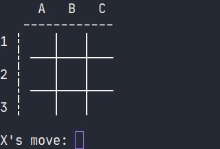
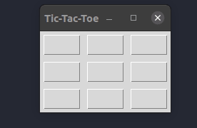

# TicTacToe AI

A Rudimentary AI based tic tac toe game in Python consisting of 2 elements:

1. Game Engine library
2. Game Clients(front ends)

## Getting started

Ensure you have the following first before you proceed:

1. [Python 3.10+](https://www.python.org/)

    You will require Python 3.1o+ to run this project. If you are using a different version of Python, you will need to
    update your Python version to 3.5+ to run this project. You can check your Python version by running python --version in
    your terminal. There are ways to install different versions of Python on your system and this can be done
    using [pyenv](https://github.com/pyenv/pyenv)

2. [Poetry](https://python-poetry.org/)

   Poetry is a Python package manager that is used to manage dependencies. You can check the installation instructions
   in the link provided to get this setup.

The [game engine library](./tictacai/) has some dependencies it needs first. You can install using `poetry`:

``` shell
poetry install
```

## Game Engine Library

The underlying game logic is encapsulated in a common library, which can be reused across
multiple [game front ends](#game-front-ends) without duplicating
the code.

### Installing

Before proceeding make sure you have created a virtual environment, activated it and installed the tictacai game engine
library into it.
This can be done using [poetry](https://python-poetry.org/), however, the setup for
the [virtual environment](https://docs.python.org/3/library/venv.html) can be done using Python(Recommendation is to use
Python 3.10 and upwards).

``` shell
cd tictac-ai
python -m venv .venv/
source .venv/bin/activate
(venv) python -m pip install tictacai/
```

> This will let you test the game front ends provided by this project

### Packaging

One of the available front ends relies on the library distributed as a Python [wheel](https://pypi.org/project/wheel/).
Therefore, you must build and package the library accordingly:

```shell
cd tictac-ai
python -m pip wheel tictacai
mv tictacai-0.1.0-py3-none-any.whl clients/browser
```

> Note that you don't need a virtual environment for these commands to work, but running them in one is completely fine.

## Game Front Ends

There are a few game front ends implemented in separate packages. Before running them, make sure you have followed the
earlier steps. Now, change directory to the game clients parent folder:

```shell
cd tictac-ai/clients/
```

### Browser Front End

Play tic tac toe in your web proser through PyScript:

```shell
python -m browser
```

This will start a local HTTP server and open the hosted HTML file in the browser. Not that you don't need to create a
virtual environment or install the game engine library to play the game because it's loaded dynamically from a Python
wheel file.

### Console Front End

Play tic tac toe in the terminal:

``` shell
(venv) python -m console
```

You can optionally set one or both players to a human player(`human`), a computer player making random moves(`random`)
or an
unbeatable minimax computer player(`minimax`), as well as change the starting player:

``` shell
(venv) python -m console -X minimax -O random --starting O
```

Sample game play:



### Window Front End

Play tic tac toe against a minimax computer player in a GUI application built with Tkinter:

```shell
(venv) $ python -m window
```

To change the players, who are currently hard coded, you'll need to edit the following fragment of the client code:

```python
def game_loop(window: Window, events: Queue) -> None:
    player1 = WindowPlayer(Mark("X"), events)
    player2 = MinimaxComputerPlayer(Mark("O"))
    starting_mark = Mark("X")
    TicTacToe(player1, player2, WindowRenderer(window)).play(starting_mark)
```

> This can be found in the file [cli.py](./clients/window/cli.py)

Sample game play:



## Built With

 1. [Python 3.10](https://www.python.org/)
 2. [Poetry](https://python-poetry.org/)

## Contributing

Please read the [contributing guide](./.github/CONTRIBUTING.md) to learn how to contribute to this project.

## Versioning

[Semantic versioning](https://semver/) is used to track the version of the project.
